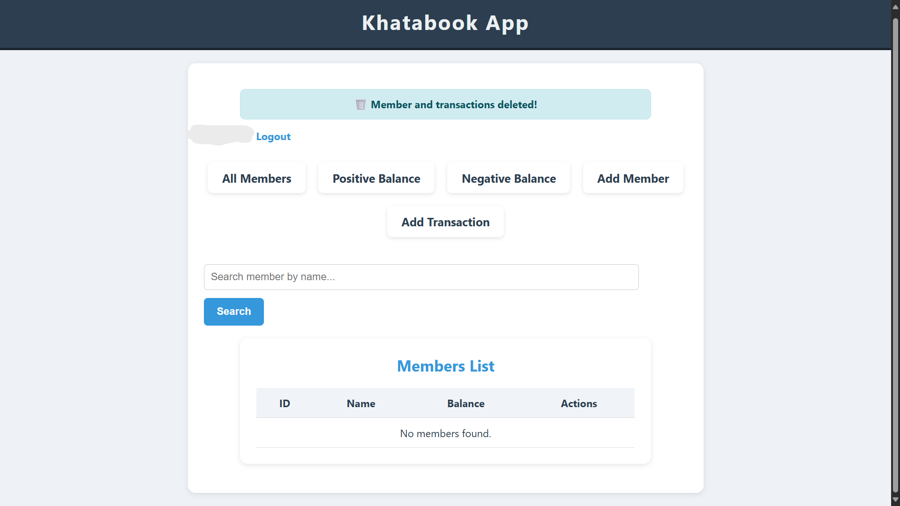
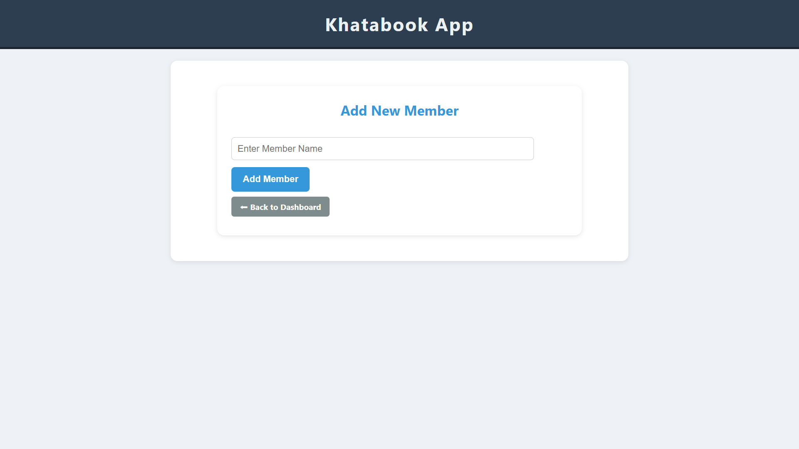
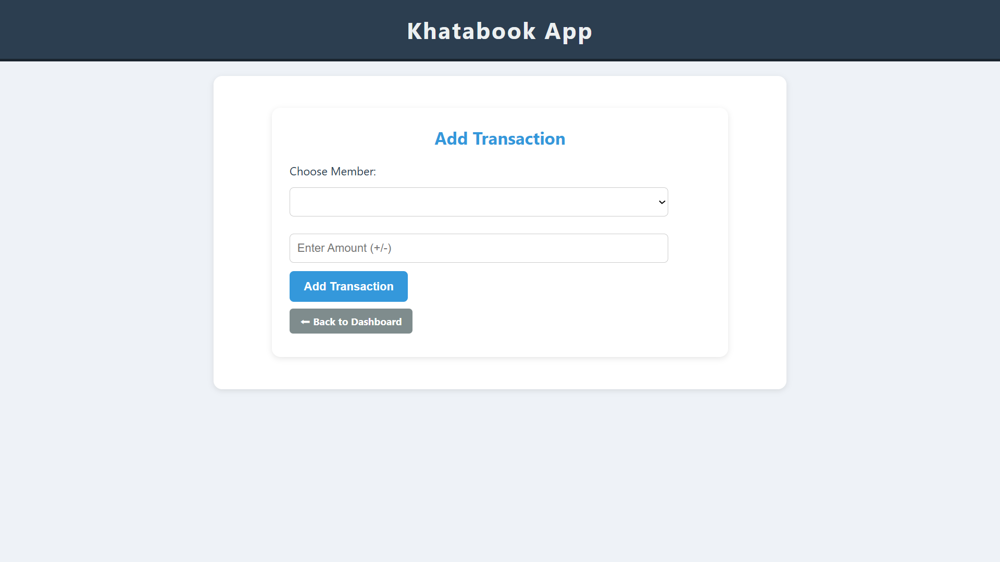

# 📒 Khanabook-Flask

Khanabook-Flask is a simple and lightweight web application built using **Flask (Python)**.  
It helps in managing members, recording transactions, and keeping track of accounts for personal or small business purposes.

---

## 🚀 Features
- ➕ Add new members  
- 👥 View existing members  
- 🗑️ Remove members  
- 💰 Record & manage transactions  
- 📊 Keep track of personal or business accounts  

---

## 📸 Screenshots 

### Home / Dashboard

### Add Member

### Add Transection

---

## 🛠️ Tech Stack
- **Python** (Flask Framework)  
- **HTML, CSS, Bootstrap** (Frontend)  
- **SQLite** (Database)  

---

## 📂 Project Structure
